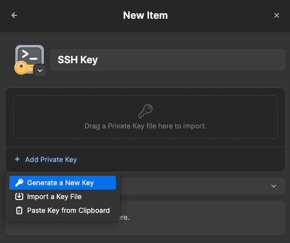
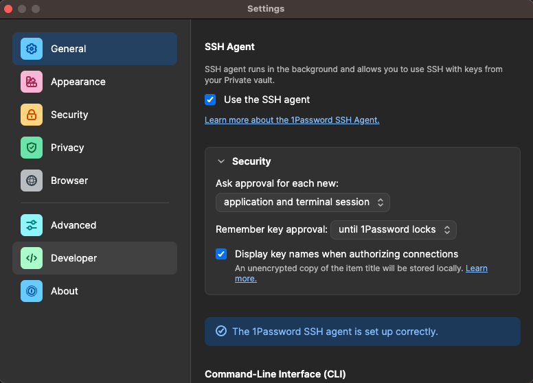
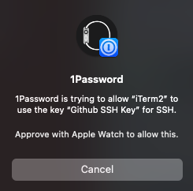
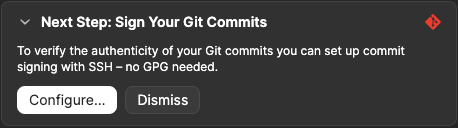
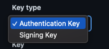

= Best practices using git

== 1password ssh agent

Using the 1password ssh agent has multiple advantages:

* use a single ssh key for each git (GitHub, GitLab, etc.) so you can replace them without messing with others
* access to your ssh keys on every device without manually copying your private keys
* your private keys are stored in 1password

NOTE: For more details visit the official documentation https://developer.1password.com/docs/ssh/get-started#step-4-configure-your-ssh-or-git-client

=== Create SSH Key in 1password

Simply create a ssh key in 1password by adding a new item and generate a new key, import or paste an existing one:



NOTE: To use a ssh key stored in 1password make sure the key is stored in your private fault otherwise it won't work. This is due to security reasons as you should never share your private key!

=== Enable 1password ssh agent

To enable the 1password ssh agent just open the preferences and got to the developer section:



NOTE: You need at least #1password 8# for this feature.

=== Use the 1password ssh agent

In order to be able to use the ssh agent, the ssh config must be supplemented accordingly:
```
Host *
  IdentityAgent "~/.1password/agent.sock"
```

This config uses a symlink created with the following command:
```
mkdir -p ~/.1password && ln -s ~/Library/Group\ Containers/2BUA8C4S2C.com.1password/t/agent.sock ~/.1password/agent.sock
```

To use the ssh agent in your shell just set the `SSH_AUTH_SOCK` environment variable:
```
export SSH_AUTH_SOCK=~/.1password/agent.sock
```

If you interact via `iterm2` or any other shell 1password will prompt you to allow access to the corresponding key:



== Sign your git commits with 1password

Since any git user can use any name or email in their configuration, it is advisable to sign a commit. This ensures that you are the author.

=== Enable signing via 1password

When you open your ssh key in 1password you will notice a small box suggesting to configure signing your commits:



Clicking on `configure` will show a configuration snippet similar to:

```
[user]
  signingkey = <your ssh key prefixed with the algorithm>

[gpg]
  format = ssh

[gpg "ssh"]
  program = "/Applications/1Password.app/Contents/MacOS/op-ssh-sign"

[commit]
  gpgsign = true
```

That's it! Now on your first commit 1password will ask you to allow accessing the ssh key for signing the commit. After pushing your commit to GitHub or GitLab you will notice a green `verified` badge in the commit history:


=== GitHub users

Since you probably already have your public ssh key stored at GitHub, you have to store the key again and select #Signing Key# in the dropdown so that your commit can be verified:




== Organizing multiple git accounts with different emails and signing keys

There are different ways to configure git using different emails and signing keys for different git accounts. +
I personally decided to use a directory for each git account (GitHub, GitLab, client a, client b etc.) and clone the corresponding repositories there. This makes the configuration easier for me. +
This way I have one git config for each client/vendor, which I name with the following scheme: .gitconfig-<clientname> or .gitconfig-github +
The content of the configs differs basically only by the different email addresses and the signing keys.

In the `.gitconfig` the individual configs are only referenced:
```
[includeIf "gitdir:~/workspace/<client a>/"]
path = .gitconfig-<client a>
[includeIf "gitdir:~/Workspace/github/"]
path = .gitconfig-github
[core]
autocrlf = input
```
